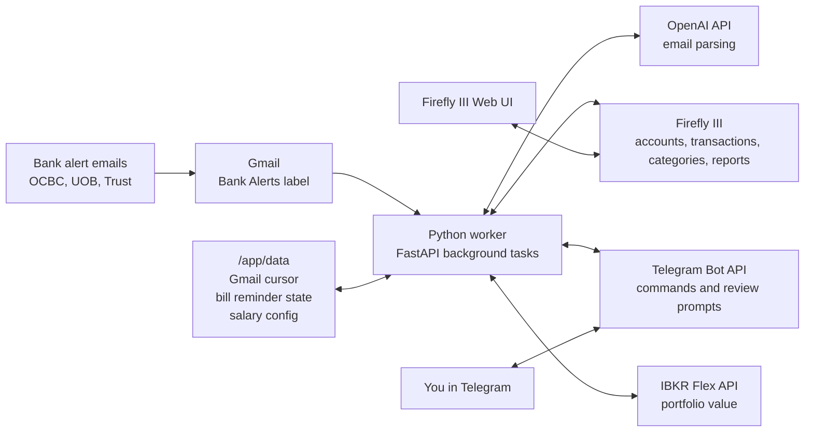
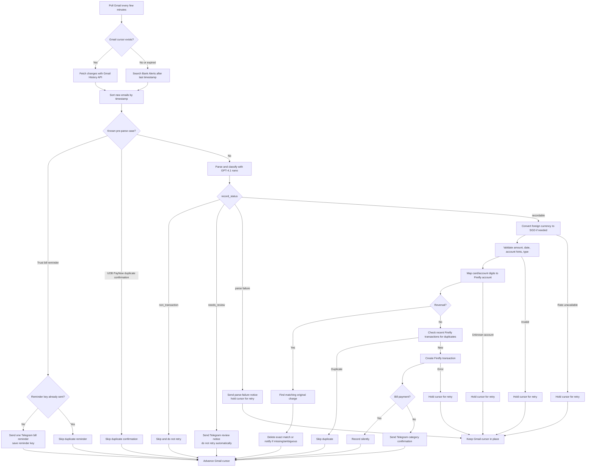
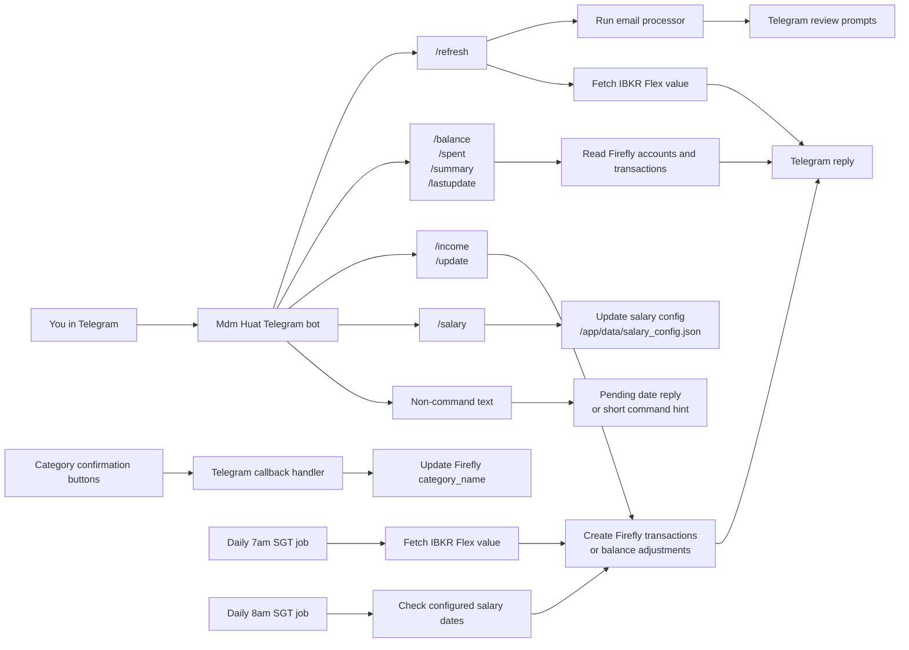

# Finance Tracker

A self-hosted personal finance tracking system for a Singapore-based couple. Automatically ingests bank transactions from email alerts, categorizes them with LLM assistance, and provides a Telegram bot for commands and management.

## How It Works

### System Overview



Firefly III is the financial source of truth. Mdm Huat reads bank alerts from Gmail, asks OpenAI to classify and parse them, records transactions in Firefly, and uses Telegram when something needs your attention. Local state in `/app/data` prevents repeated Gmail processing, duplicate Trust bill reminders, and repeated monthly salary deposits.

### Email Processing Flow



Trust credit-card bill emails are reminders only: they send one Telegram message per bill cycle and never create Firefly transactions. Non-transaction bank emails are skipped after classification so login alerts, OTPs, marketing, and duplicate confirmations do not retry forever.

### Telegram And Automation Flow



For ordinary spending, Firefly gets one generic expense account: `Merchant Spend`. The merchant name is kept in the transaction `description`, and the spend category is stored in Firefly's `category_name`. Telegram category confirmations update `category_name`, while `/spent` and `/summary` still use the description to show merchant-level reporting. Credit-card bill payments to mapped cards are recorded silently without category prompts.

## Telegram Bot Commands

| Command | Description |
|---------|-------------|
| `/refresh` | Fetch new transactions + update IBKR |
| `/balance` | Show all account balances and net worth |
| `/spent [period] [category]` | Show spending for a period |
| `/summary [period]` | Spending summary with category breakdown |
| `/income <amount> <source> [account]` | Record incoming money, with optional backdating |
| `/salary` | View/manage recurring monthly salaries |
| `/update <account> <amount>` | Manually set account balance |
| `/lastupdate` | Show last activity date per account |
| `/help [command]` | Help overview or detailed command usage |

Non-command text is used only for pending date replies after `/income`; otherwise the bot asks you to use `/help` or a slash command.

### Period Formats

`today`, `yesterday`, `this week`, `last week`, `this month`, `last month`, `this year`, `last year`, `last N days/weeks/months`, `january`, `feb 2025`, `jan to mar`, `feb - jun 2025`.

## Tech Stack

- **Firefly III** -- financial backend + web dashboard
- **Python 3.11+ / FastAPI** -- worker service
- **python-telegram-bot** -- Telegram bot
- **OpenAI API** -- GPT-4.1 mini (email parsing)
- **Gmail API** -- email ingestion (label-based filtering)
- **IBKR Flex Web Service** -- investment portfolio data
- **Docker Compose** -- deployment
- **Cloudflare Tunnel** -- HTTPS without port forwarding
- **uv** -- Python dependency management

## Project Structure

```
finance-tracker/
├── docker-compose.yml
├── .env.example
├── pyproject.toml
├── worker/
│   ├── Dockerfile
│   ├── main.py                # FastAPI + startup + background tasks
│   ├── config.py              # Environment variable loading
│   ├── bot/
│   │   ├── telegram_bot.py    # Bot setup, auth, notifications
│   │   ├── commands.py        # All command handlers
│   │   ├── callbacks.py       # Category confirmation keyboards
│   ├── parsers/
│   │   ├── llm_email_parser.py
│   │   └── validator.py
│   ├── integrations/
│   │   ├── gmail_client.py
│   │   ├── firefly_client.py
│   │   ├── ibkr_flex.py
│   │   └── openai_client.py
│   ├── services/
│   │   ├── transaction_processor.py
│   │   ├── categorizer.py
│   │   ├── account_mapper.py
│   │   └── salary.py
│   └── utils/
│       └── dedup.py
└── tests/
```

## Setup

### Prerequisites

- Docker + Docker Compose
- Gmail account with bank alert emails
- Telegram bot (via @BotFather)
- OpenAI API key
- IBKR account with Flex Query (optional)
- Domain with Cloudflare DNS

### Quick Start

1. Clone the repo
2. Copy `.env.example` to `.env` and fill in credentials
3. Set up Gmail label "Bank Alerts" with filters for bank sender addresses
4. Set up Cloudflare Tunnel pointing to `localhost:8080`
5. Start services:
   ```bash
   docker compose up -d firefly
   # Configure Firefly III via web UI (accounts, categories, API token)
   docker compose up -d --build worker
   ```

See `finance-tracker-spec.md` for detailed setup instructions.

### Firefly III Accounts

**Assets:** OCBC Child Savings Account, UOB One Account, IBKR Portfolio, Syfe Cash, Market Value Adjustment

**Liabilities:** UOB Absolute Cashback Amex, Trust Card

### Environment Variables

See `.env.example` for the full list. Key variables:

- `FIREFLY_TOKEN` -- Firefly III Personal Access Token
- `FIREFLY_MERCHANT_EXPENSE_ACCOUNT` -- generic expense account for merchant spending (defaults to `Merchant Spend`)
- `GMAIL_CREDENTIALS` -- Gmail OAuth2 JSON
- `TELEGRAM_BOT_TOKEN` / `TELEGRAM_CHAT_ID`
- `OPENAI_API_KEY`
- `IBKR_FLEX_TOKEN` / `IBKR_FLEX_QUERY_ID`
- `ACCOUNT_MAP` -- JSON mapping card/account digits to Firefly accounts
- `CARD_RULES` -- optional JSON list of extra card aliases, issuer patterns, and repayment aliases

## Development

```bash
uv sync                              # Install dependencies
uv run uvicorn worker.main:app --reload  # Run locally
.venv/bin/ruff check worker/         # Lint
.venv/bin/ruff format worker/        # Format
.venv/bin/python -m pytest tests/ -q # Test
```

## Deployment

```bash
git pull
docker compose up -d --build worker  # Rebuild worker
docker compose pull                  # Update Firefly III
docker compose up -d                 # Restart all
```

## Backups

Daily automated backup to Google Drive via `rclone`:
- Firefly III SQLite database
- `.env` file (GPG encrypted)

Scheduled at 4am via cron. See `~/backup.sh` on the server.

## Costs

~$1-5/month (OpenAI API usage only). All other services are free.
